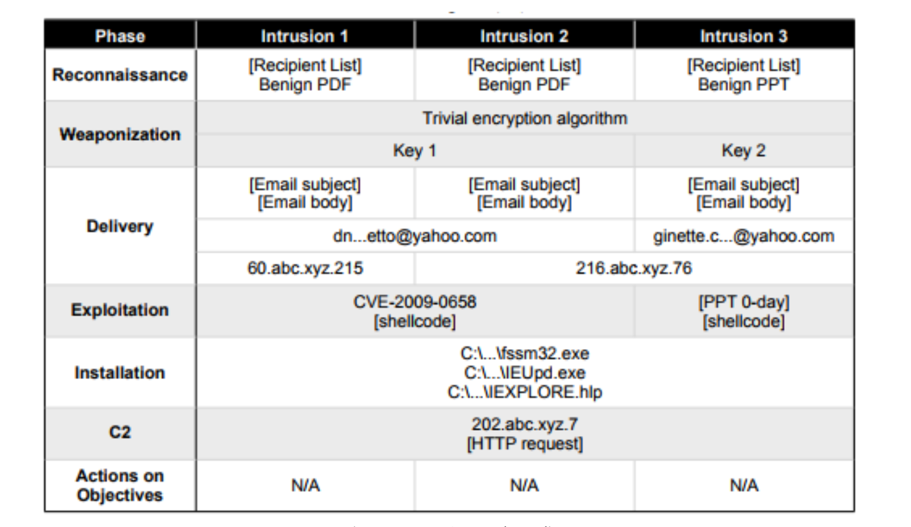

- Cyber Kill Chain: It was introduced as Intrusion Kill Chain in a paper published by Lockheed Martin in 2009 that analyzed numerous hacking attacks and established response strategies, and later changed to Cyber Kill Chain
Kill Chain: A strategy to neutralize missiles with a preemptive strike to defend them in military terms
- Preemptive defense techniques to mitigate and eliminate threats by analyzing cyber attack processes and threats posed to the organization at each attack stage and the attacker's purpose, activities, etc

Cyber Kill Chain 7단계

Reconnaissance for Target Analysis

- Determine the target and identify the target
- Collecting information such as e-mail addresses that can be used to attack targets

Weaponization for Target Attacks

- Combine Exploit with Backdoor to generate malicious code - based on the attack target information identified earlier
Leverage known or zero-day vulnerabilities

Delivery to Target

- Attach files to your target email, link websites, USB, etc
It distributes malicious code in various ways.

Exploitation

- The malicious code delivered to the target target is activated
The malicious behavior intended by the attacker is carried out.

Installation of Malicious Code

- Make sure that attackers have continuous access to the target
Install a backdoor or remotely controllable malicious program.

Remote Control (command & control)

- Utilize targets for manual manipulation and access to internal targets through communication channels that allow attackers to control them
Actions on objects such as information leakage, system destruction, etc. - Attackers successfully collect targeted data and obtain results

![CyberKillChain] (cyber2.png "Step-by-step response type according to CyberKillChain attack procedure)

ATT&CK

- MITRE began by documenting TTPs (Tactics, Techniques, and Procedures) for hacking technologies used in Windows networks.
- Subsequently, it was developed as a framework that allows identification of what was used for TTPs
- It was first completed in September 2013 and then released in May 2015 to help more places
- Focus on strengthening analysis and detection capabilities for cyberattacks
- To help attackers segment and reproduce real-world technologies with unit technologies
- Tactics: It is translated as a career tactic, and this part is mapped to "Why". Currently, there are 12 tactics in the enterprise, explaining the purpose (reason) of detailed technologies.
- Techniques: It is commonly translated as technology and mapped to "How". It explains which technology the actual hacker used and describes 244 detailed technologies that are not currently duplicated in the enterprise.
- Procedure: This is an actual detailed attack method attempted to proceed with the techniques.

Expected Effects of ATT&CK Framework
1. Adversary behavior analysis: Exploring actual attacks by focusing on attackers' activities and related skills
We want to increase the possibility of detection. Domain, IP, file hash, etc., which are IOC values mainly used for intrusion detection, are bypassed or forged/modified
I want to explain which part is more helpful for detection than this
2. Lifecycle models that didn't fit: Cyber Kill Chain is a line for actual defense
Too high-level concept to explain the trick. So trying to help with the actual action trick
3. Applicability to real environments: Apply TTPs identified through accident investigation to the real environment
To make it testable
4. Common taxonomy: TTPs are compared to other attack groups or technologies by unifying terms
to facilitate

![CyberKillChain] (attack.png "Attack Overview")
