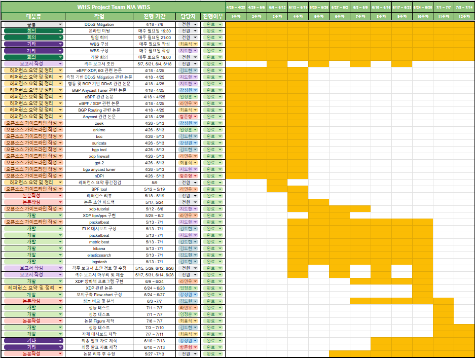

## The second project of the White Hat School of the Korea Information Technology Research Institute
(Development of DDoS attack mitigation security equipment in low-spec environments)

The project focused on developing **security equipment** that can leverage **eBPF/XDP** and **BGP** to detect **DDoS attacks in real time and block malicious packets even in low-spec environments. In addition, **ELK Stack** can be used to build monitoring web pages to check real-time network status.

### Key Features:
- **eBPF/XDP based packet filtering**: detect malicious packets in real time and efficiently handle low-spec environments
- **BGP Routing**: Dynamic network path changes to mitigate DDoS attacks
- **ELK Stack Monitoring Web Page**: Provides real-time monitoring dashboard with Elasticsearch, Logstash, and Kibana

### Project Objectives:
1. **DDoS attack mitigation**: Build highly efficient packet monitoring and blocking systems even in low-spec environments
2. **Real-time network monitoring**: Real-time network health monitoring and attack detection via ELK stack
3. **Ensure network stability**: Routing changes using BGP maximize network stability

## Mentors and key personnel

### Mentor
- **Keonho Park** (Tatum Security)

### Project Leader (PL)
- **Kwaksong** (Tatime Security)

### Project Manager (PM)
- **Ham Joon-hyung** (Baejae University) [LinkedIn](https://www.linkedin.com/in/%EC%A4%80%ED%98%95-%ED%95%A8-669898284/)

### a team member
- **Sungwon Kang** (Pai Chai University)
- **최홍석** (Jeonbuk National University) [LinkedIn](https://www.linkedin.com/in/%ED%99%8D%EC%84%9D-%EC%B5%9C-089b23302?utm_source=share&utm_campaign=share_via&utm_content=profile&utm_medium=ios_app)
- **Im Jung-hoon** (Chosun University) [LinkedIn](https://www.linkedin.com/in/%EC%A0%95%ED%9B%88-%EC%9E%84-235b06304/)
- **Ji Ji-hwan** (National Hanbat University)[LinkedIn](www.linkedin.com/in/ Jung Hoon-Im-235b06304/)
- **Dohyun Kim** (Gangneung Wonju University)
- **Ra Min-woo** (Kunchuk University) [LinkedIn](https://www.linkedin.com/in/raminwo/)

## Network Information
- **Network:** AS216362 (hamjoon type)
- **업스트림:** AS20473 (The Constant Company, LLC), AS199524 (G-Core Labs S.A.)
- **Anicast Network: ** AS199524 (G-Core Labs S.A.)

[홈페이지](https://ddosmitigation.github.io/)

### flowchart:

### WBS(Work Breakdown Structure):

### Project
