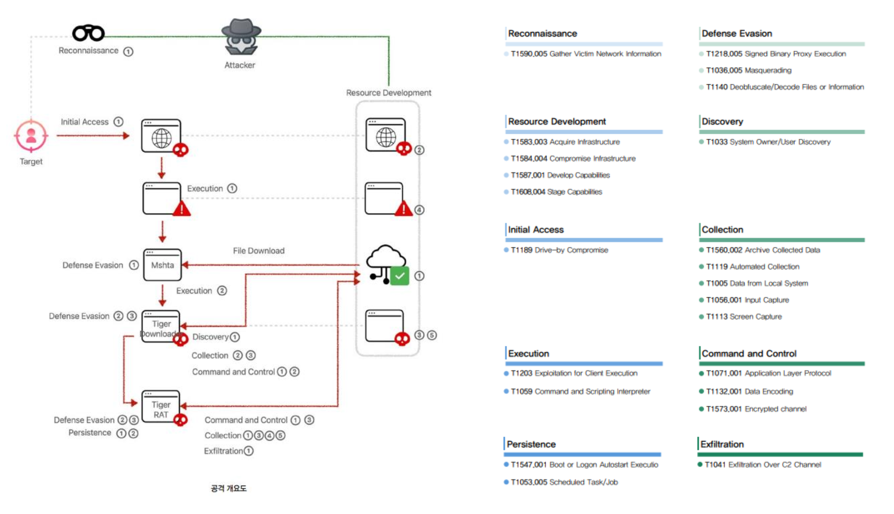

- Cyber Kill Chain : 2009년 록히드 마틴사에서 수많은 해킹 공격을 분석하고 대응전략을 수립해 발표한 논문에 서 Intrusion Kill Chain으로 소개되었다가, 이후 Cyber Kill Chain으로 변경해 사용되고 있음
Kill Chain : 군사용어로 미사일을 방어하기 위해 선제 공격으로 미사일을 무력화 시키는 전략
- 사이버 공격 프로세스를 분석하여 각 공격 단계에서 조직에 가해지는 위협 요소 및 공격자의 목적, 활동 등을 분석하여 위협요소를 완화, 제거하는 선제적 방어 기법

Cyber Kill Chain 7단계

타깃 분석을 위한 정찰(Reconnaissance)

- 목표물을 정하고 대상을 식별
- 목표물공격에활용할수있는이메일주소등의정보수집

타깃 공격을 위한 무기작성(Weaponization)

- Exploit과 백도어를 결합하여 악성코드 생성 - 앞서파악한공격대상정보에따라
알려진 취약점 또는 제로데이 취약점을 활용

타깃에 전달(Delivery)

- 목표 대상에게 이메일에 파일 첨부, 웹사이트 링크, USB 등의
다양한 방식으로 악성코드를 유포한다.

권한탈취(Exploitation)

- 대상 목표에 전달된 악성코드가 활성화되면서
공격자가 의도한 악의적 행위가 실행된다.

악성코드 설치(Installation)

- 공격자가 지속적으로 대상에 접근할 수 있도록
백도어나 원격제어가 가능한 악성 프로그램을 설치한다.

원격제어(Command & Control)

- 공격자가 대상물을 제어할 수 있는 통신 채널을 통해 대상을 수동조작 및 내부 목표물에 접근하도록 활용
정보유출, 시스템파괴 등의 목적수행(Actions on objectives) - 공격자가 목표한 데이터 수집에 성공하여 결과물 획득

ATT&CK

- MITRE에서 윈도우 네트워크에 실제 사용되는 해킹 기술에 대해서 TTPs(Tactics, Techniques, and Procedures) 를 문서화하는 것으로 시작되었다.
- 이후, TTPs에 대해 사용된 것을 식별할 수 있도록 해주는 프레임워크로 개발되었음
- 2013년 9월에 처음 완성되었고, 이후 보다 많은 곳에 도움이 되고자 2015년 5월에 최초 공개
- 사이버공격에대한분석및탐지역량강화에초점이맞춰져있음
- 공격자가 실제 사용하는 기술들을 세분화하여 이를 단위 기술로 재연할 수 있도록 돕기위함
- Tactics : 통산 전술이라고 번역을 하는데, 이 부분은 “Why”에 맵핑된다. 현재 엔터프라이즈에는 12개의 전술이 존재하는데, 세부기술들의 목적(이 유) 등을 설명하고 있다.
- Techniques : 기술이라고 통상 번역되며, “How”로 맵핑된다. 실제 해커가 어떤 기술을 이용했는지를 설명하는 것으로 엔터프라이즈에는 현재 중복 되지 않는 244개의 세부 기술을 설명하고 있다.
- Procedure : 공격 기술(Techniques) 진행을 위해 시도한 실제 상세 공격 방법이다.

ATT&CK 프레임워크 활용 기대 효과
1. 악의적 행위(Adversary behaviors) 분석 : 공격자의 활동과 관련 기술에 대해서 집중함으로써 실제 공격 탐
지 가능성을 높이고자 함. 침해 탐지에 주로 사용되는 IOC 값인 도메인, IP, 파일해시 등은 우회 또는 위/변조
등이 가능해 이보다 어떤 부분이 더욱 탐지에 도움이 되는지를 설명하고자 함
2. 적절하지 않은 라이프사이클 모델(Lifecycle models that didn’t fit) : Cyber Kill Chain은 실제 방어를 위한 행
동 요령을 설명하기에는 너무 상위 레벨의 개념. 따라서 실제 행동 요령에 도움을 주고자 함
3. 실제 환경에 적용(Applicability to real environments) : 사고조사를 통해 확인된 TTPs를 실제 환경에 적용해
테스트할 수 있도록 하기 위함
4. 분류체계 (Common taxonomy) : TTPs에 대해 다른 공격 그룹이나 기술들에 대해 용어의 통일을 통해 비교
를 용이하게 하기 위함

