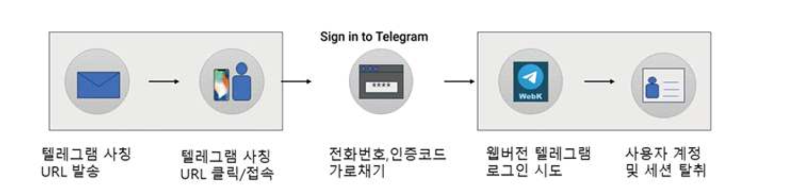
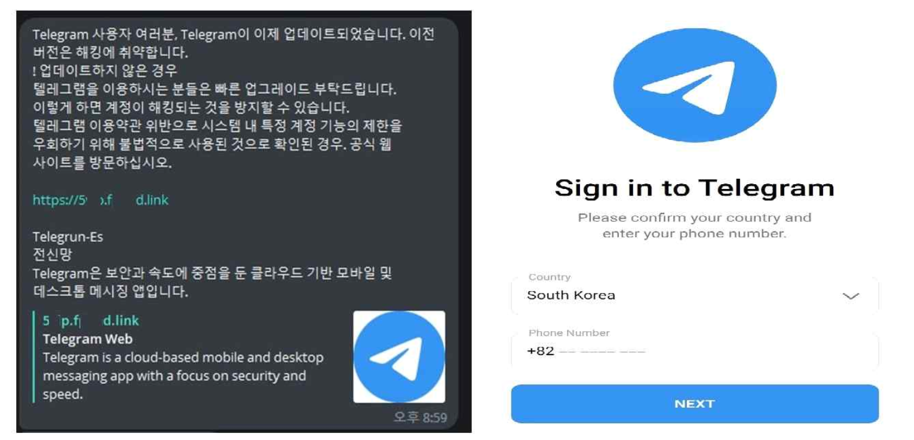
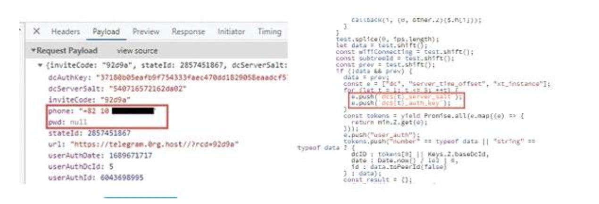

1. 텔레그램 사칭 피싱사이트 위협
텔레그램은 보안에 중점을 둔 메신저 어플로, 스마트폰, PC, 태블릿 등 모든 기기에서 간편하게 사용할 수 있다. 하지만 최근 텔레그램 메신저를 이용한 해킹 피해 사례가 급증하고 있어 이용자들의 주의가 요구된다. 해커들은 텔레그램을 통해 고전적인 피싱 수법으로 이용자들의 개인정보를 빼갔다. 고전적인 피싱 수법이 현대까지도 사용되는 이유가 무엇일까? 그것은 바로 일반인들이 ‘텔레그램은 보안이 뛰어나다’라고 생각하기에 해커들이 이를 악용을 한 것이다.

국내에서는 주로 포털사이트 계정을 탈취하기 위한 피싱 공격이 발생하고 있으나, 23년 7월 초부터 국내 텔레그램 사용자 계정을 노린 피싱 공격도 다수 탐지되고 있다. 최근 텔레그램 피싱공격은 1차 계정 탈취한 후, 등록된 연락처의 지인들에게 ‘계정 재인증 필요’, ‘최신버전 업데이트’와 같은 메시지를 추가 발송하여 지인을 대상으로 2차 계정 탈취 공격을 수행한다. 특히, 텔레그램 로그인 피싱 사이트는 육안으로도 판단할 수 없을 만큼 구별이 어렵다.

만약 사용자가 피싱사이트에 속아 전화번호를 입력하게 되면, 해커는 악성 스크립트를 실행하여 새로운 장치에서 공식 텔레그램 웹서버에 가로챈 계정으로 로그인 인증을 시도한다. 만약 텔레그램의 2단계 인증이 비활성화된 경우라면 해커가 사용자의 계정에 로그인하기 위해 필요한 것은 오직 전화번호와 인증코드 뿐이다. 해커가 텔레그램 웹 로그인을 통해 세션을 탈취하고 나면 기존 대화내용, 연락처 등을 포함하여 텔레그램 계정을 사실상 완전히 장악할 수 있다.

2. 텔레그램 사칭 피싱사이트 분석 결과
해당 텔레그램 피싱사이트를 상세분석한 결과 인증키, 초대코드, 전화번호, 토큰 등 텔레그램 웹 로그인에 필요한 계정정보를 수집한다. 일단 해당 사이트에 접속하게 되면 접속하는 IP를 기준으 로 자동으로 해당 국가, 국가 전화번호가 자동으로 입력된다. 공격자의 서버에는 1차 공격으로 탈취한 계정과 연락처 목록을 수집하고, 2차 계정 탈취를 위해 메시지를 발송하는 자동화된 피싱 도구가 존재하는 것으로 추정된다. 현재는 오픈소스에 공개된 소스코드를 기반으로 단순 로그인 피싱사이트를 제작하고 있으나 향후 사용자 몰래 웹브라우저 정보를 빼내는 세션 가로채기 기법 보다 정교한 공격으로 진화할 것으로 예상된다.

이와 같이 안드로이드 및 아이폰 기기와 상관없이 모바일 해킹에 당할 수 있기 때문에 사용자는 기본적으로 개인용 PC와 스마트폰 보안을 강화하기 위해 메신저 어플 접속 시 2차 인증설정과 지인이 보낸 메시지라도 출처가 불분명한 사이트 접속은 자제하는 주의가 필요하다. 만일, 피싱 메시지를 수신했다면 절대로 접속하거나 사용자 정보를 입력해서는 안된다.
