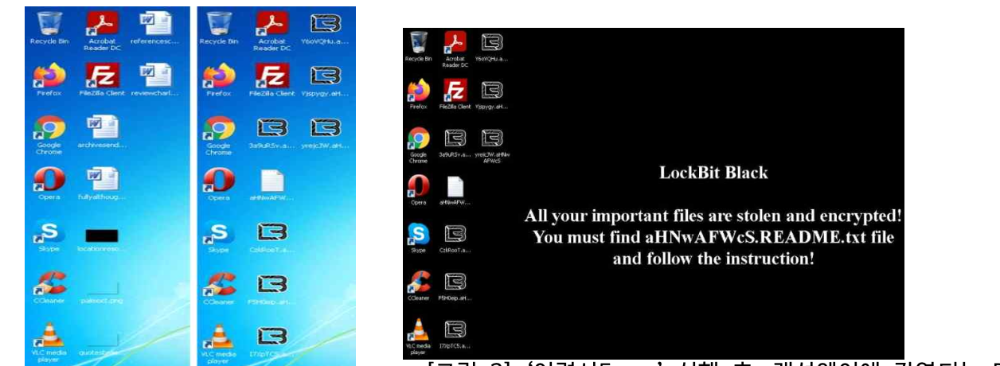
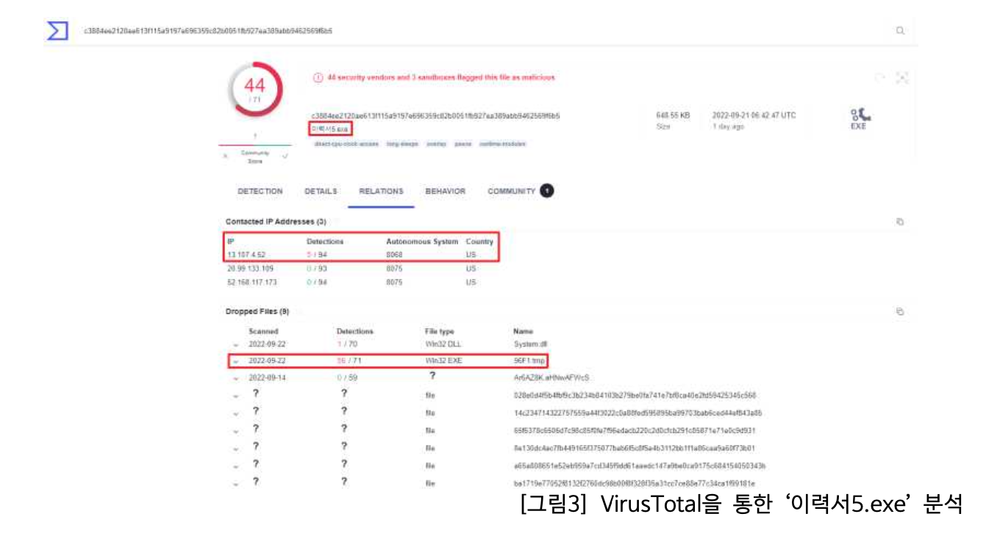

LockBit 3.0 랜섬웨어는 랜섬웨어 범죄 조직 LockBit이 제작한 랜섬웨어이다. 이 해킹 조직은 전 세계 기업들을 대상으로 엄청난 금전적 피해를 입혔으며, 2022년 7월 초 LockBit 3.0으로 버전 업그레이드르 하여 다시 등장했다. LockBit 3.0 랜섬웨어에 감염되면, 다른 랜섬웨어 공격과 동일하게 감염된 장치의 모든 파일들이 암호화되며, 감염된 장치의 데이터를 복구하거나 유출을 막기 위해서는 몸값을 지불하라고 요구한다.
또한, 최근 LockBit 3.0의 빌더 소스코드가 온라인에 유출되면서 LockBit 3.0 빌더를 악용해 자체적인 공격을 수행하는 다른 공격자 또는 랜섬웨어 그룹들이 더욱 증가할 것으로 보인다. 이는 앞으로 더 많은 기업이 랜섬웨어를 통한 엄청난 타격을 입을 것으로 예상되는 심각한 보안 이슈이다.
이력서로 위장한 LockBit3.0 랜섬웨어 유포 메일
2022년 한 기업 메일에 다음과 같은 이력서 이메일이 수신되었다. 메일 제목은 ‘허지안’으로 사람 이름과 비슷한 형태였고, 메일의 내용도 입사 지원을 하기 위해 이력서를 보낸다는 평범한 내용이다. 이력서로 위조된 아래 메일은 LockBit 3.0 랜섬웨어 악성코드를 유포하기 위해 이력서로 위장한 공격 메일이다. 메일 내용은 입사지원에 대한 내용이지만, 자세히 살펴보면, 문장의 앞 뒤 문맥이 어색하거나 맞춤법이 틀린 부분들이 대다수이다. 또한, 별도의 첨부 파일은 없었고, ‘포트폴리오 확인’이라는 텍스트에 파일 다운로드 링크가 삽입되어있다.

링크에서 다운 받은 이력서.exe 파일을 실행시키면, 바탕화면 배경 이미지도 LocklBit Black의 메시지가 담긴 이미지로 변경하게 된다. 바탕화면의 내용에 따라 README.txt라는 파일명의 랜섬웨어 노트를 찾아 실행하면, 다음과 같은 내용이 보여지는데, ‘몸값을 지불하지 않으면 데이터를 Tor 다크웹 사이트에 유출하겠다’라는 협박과 함께 LockBit 3.0 다크웹 사이트의 링크가 첨부되어있다.

LockBit 3.0 악성 코드 파일 분석 결과

‘이력서5.exe’ 파일을 분석하기 위해 VirusTotal에 파일을 업로드 한 결과 총 71가지의 Anti Virus 백신 중 44개의 백신이 “이력서5.exe”파일을 바이러스로 감지하였고, “13.107.4.52” IP 주소가 5회 연관된 것을 확인할 수 있다.
또한, 이력서5.exe 실행 시, 96F1.tmp 라는 파일이 어딘가에 저장되어 실행하고 있었으며, 이 역시 71개의 백신 중 56개의 백신이 탐지했다는 결과가 있다.

96F1.temp 파일에 대한 VirusTotal 분석을 진행해본 결과, 96F1.tmp 파일의 경우, Drop
 
File이 아닌 Execution Parents에 해당 되는 파일이 다수 확인됨을 알 수 있다.
LockBit의 공격 실행 순서는 이력서5.exe 파일이 Dropper의 역할을 하며, 96F1.tmp을 통해 랜섬웨어가 동작하는 구조이다.
또한, 96F1.tmp에도 이력서5.exe 파일과 동일한 IP주소를 가지고 있는데, 이를 통해 해당 IP주소가 공격자가 사용하는 감염된 좀비 서버임을 유추할 수 있다.
현재 유출된 LockBit 3.0 빌더 소스코드로 인해 수 많은 해커들이 자체적으로 이 같은 공격을 수행할 것으로 심각하게 우려되고 있다.
LockBit 3.0 랜섬웨어 공격을 예방하기 위해서는 LockBit 3.0 랜섬웨어 악성코드에 연관된 IP 주소를 보안 시스템의 블랙리스트에 등록하거나, 이력서 등의 이메일 수신 시 메일 내용에 의심스러운 부분이 없는지 확인하거나, 의심스러운 파일이 첨부되어 있을 경우 함부로 열지 않는 것이 중요하다.

