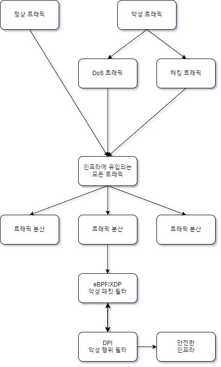
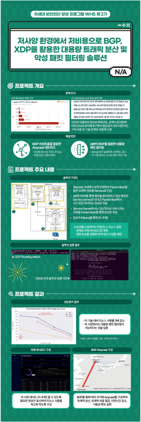

### 한국정보기술연구원 화이트햇 스쿨 2기 프로젝트 (저사양 환경에서의 DDoS 공격 완화 보안 장비 개발)

이 프로젝트는 **eBPF/XDP**와 **BGP**를 활용하여 저사양 환경에서도 **DDoS 공격**을 실시간으로 탐지하고 악성 패킷을 차단할 수 있는 **보안 장비**를 개발하는 데 중점을 두었습니다. 또한, **ELK 스택**을 이용해 모니터링 웹 페이지를 구축하여 실시간 네트워크 상태를 확인할 수 있습니다.

#### 주요 기능:
- **eBPF/XDP 기반 패킷 필터링**: 실시간으로 악성 패킷을 탐지하고, 저사양 환경에서도 효율적으로 처리
- **BGP 라우팅**: 네트워크 경로를 동적으로 변경하여 DDoS 공격을 완화
- **ELK 스택 모니터링 웹 페이지**: Elasticsearch, Logstash, Kibana를 활용한 실시간 모니터링 대시보드 제공

#### 프로젝트 목표:
1. **DDoS 공격 완화**: 저사양 환경에서도 높은 효율을 자랑하는 패킷 모니터링 및 차단 시스템 구축
2. **실시간 네트워크 모니터링**: ELK 스택을 통해 실시간으로 네트워크 상태를 모니터링하고 공격을 탐지
3. **네트워크 안정성 보장**: BGP를 이용한 라우팅 변경으로 네트워크의 안정성을 극대화

## 멘토 및 주요 인원

### 멘토
- **박건호** (테이텀 시큐리티)

### 프로젝트 리더 (PL)
- **곽송이** (테이텀 시큐리티)

### 프로젝트 매니저 (PM)
- **함준형** (배재대학교) [LinkedIn](https://www.linkedin.com/in/%EC%A4%80%ED%98%95-%ED%95%A8-669898284/)

### 팀원
- **강성원** (배재대학교)
- **최홍석** (전북대학교) [LinkedIn](https://www.linkedin.com/in/%ED%99%8D%EC%84%9D-%EC%B5%9C-089b23302?utm_source=share&utm_campaign=share_via&utm_content=profile&utm_medium=ios_app)
- **임정훈** (조선대학교) [LinkedIn](https://www.linkedin.com/in/%EC%A0%95%ED%9B%88-%EC%9E%84-235b06304/)
- **지도환** (국립한밭대학교) [LinkedIn](www.linkedin.com/in/정훈-임-235b06304/)
- **김도현** (강릉원주대학교)
- **라민우** (건국대학교) [LinkedIn](https://www.linkedin.com/in/raminwo/)

## 네트워크 정보
- **네트워크:** AS216362 (함준형)
- **업스트림:** AS20473 (The Constant Company, LLC), AS199524 (G-Core Labs S.A.)
- **애니캐스트 네트워크:** AS199524 (G-Core Labs S.A.)

[홈페이지](https://ddosmitigation.github.io/)

#### flowchart:

#### WBS(Work Breakdown Structure):

#### Project

